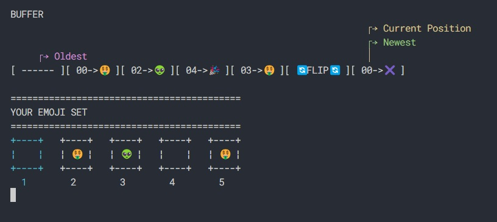

## Practice Repositories

### 1. Console applications
|  |  |
|:-|:-|
| **Repo:** [Undo Redo Buffer](https://github.com/dikarkik/UndoRedoBuffer)  **Stack:** .NET 8 |  |
| **Repo:**   **Stack:**   |  |

### 2. Games
|  |  |
|:-|:-|
| **Repo:**   **Stack:**  |  |
| **Repo:**   **Stack:**   |  |

### 3. Web APIs
|  |  |
|:-|:-|
| **Repo:**   **Stack:**  **Type:**  |  |
| **Repo:**   **Stack:**  **Type:** |  |

### 4. Webpages
|  |  |
|:-|:-|
| **Repo:**   **Stack:**  **Type:** SPA |  |
| **Repo:**   **Stack:**   **Type:** |  |